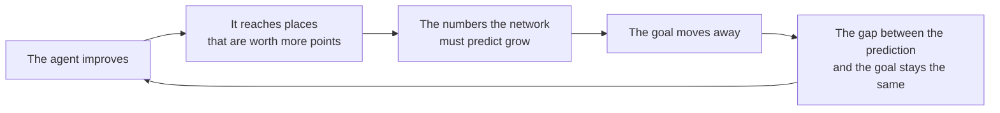
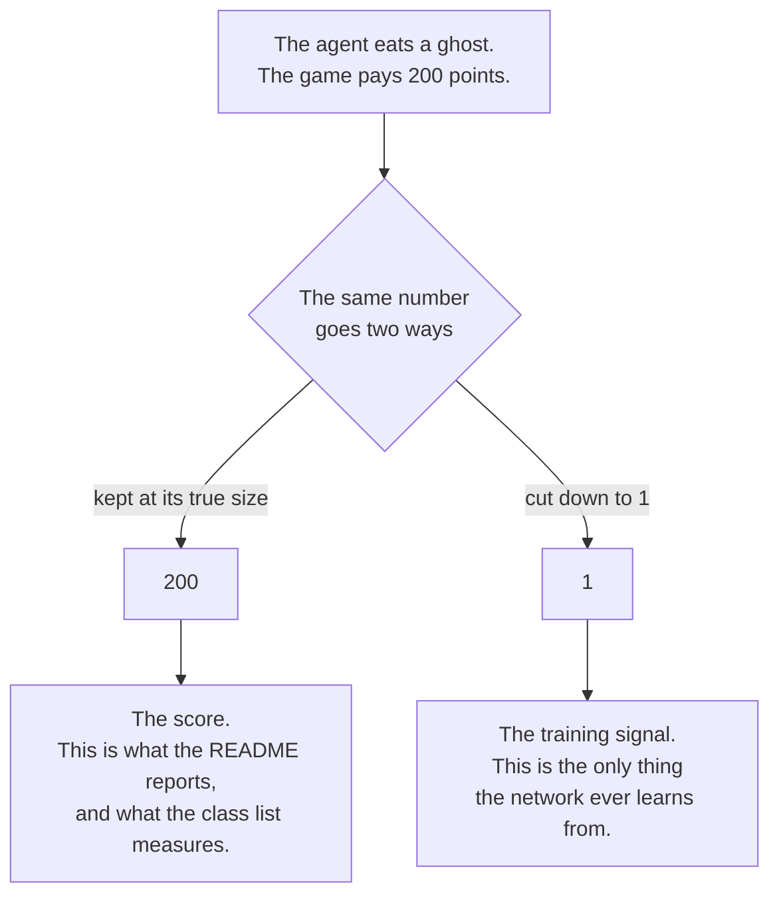
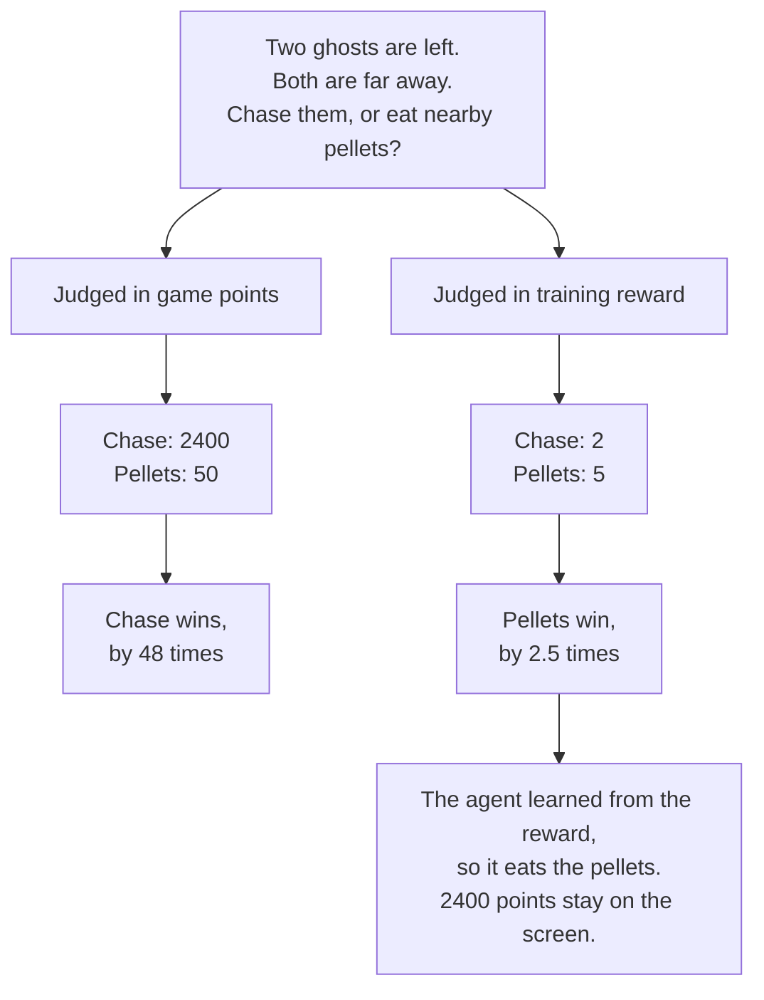

# Findings

This page gives the evidence behind each statement in the [README](README.md).

It answers three questions. What did the run show? What does the evidence not show? What did
the method itself teach?

Every number comes from the [`results/`](results/) folder. Each section names its source.

The [README glossary](README.md#words-used-in-this-repository) explains the technical words.

---

## 1. The agent learned, and the result is not chance

The average score rose from 492 to 2578. That is an increase of 2086 points.

Five games is a small test. A small test can give a good result by chance. The check is to
compare the change with the distance between the five results.

| Measure | Value |
|---|---|
| Change in the average | +2086 |
| Distance between the five later results | 1060, from 2050 to 3110 |
| Results that improved | 5 of 5 |
| Lowest later result against highest earlier result | 2050 against 800 |

The change is about two times the distance. No later game scored less than any earlier game.
The two sets of results do not overlap at any point.

Source: `results/comparison.json`.

---

## 2. The prediction error never fell, and the agent still improved

This is the most useful finding for understanding what the error measures.

The course brief warns that a falling error does not prove better play. This run shows the
same lesson from the opposite side.

The error **rose** from 0.02 to about 0.13 in the first 100 games. It then stayed between 0.10
and 0.14 for the remaining 7500 games. It fell only a little at the end. In the same period
the score more than doubled.

| Games | Average score | Average error |
|---|---|---|
| 1 – 762 | 811 | 0.117 |
| 3049 – 3810 | 1453 | 0.120 |
| 6859 – 7620 | 1993 | 0.096 |

### Why the error stays level

The network is measured against a goal that it also produces.

The network predicts the points it expects. To build the goal, the program uses the network's
own prediction of the next position. A second, slower copy of the network supplies that
prediction. The program refreshes that copy every 1000 decisions.



The goal moves away as fast as the network approaches it. The error therefore stays about the
same, while the play improves.

Think of a person walking towards a horizon. The walker moves. The distance does not change.
That distance is the error. It says nothing about the progress of the walker.

**Do not read the error as a measure of progress.**

Source: `results/training.csv`, `results/training_dashboard.png`.

---

## 3. The agent survives longer, and also collects points faster

A higher score can have one dull explanation: the agent lives longer and eats the same pellets
more slowly. Two measurements rule that out.

| Measure | Before | After | Change |
|---|---|---|---|
| Decisions in one game | 589 | 976 | +66% |
| Game points for each decision | 0.84 | 2.64 | +214% |

If the agent had only learned to stay alive, the points for each decision would not change. It
rose by more than three times. The agent eats more, and it also lives longer.

Source: `results/comparison.json`.

---

## 4. The agent never reaches the time limit

No game reached the limit of 3000 decisions. This is true of the 5 games before training, the
5 games after training, and all 305 games recorded during training.

The longest game after training used 1018 of the 3000 decisions. That is about one third.

Every game ends because a ghost catches the agent. The time limit never stops a game. Avoiding
ghosts is therefore the limit on the score. It is also the part the reward teaches least well:
the agent receives no penalty when it loses a life, and the game continues. The only cost of
dying is the pellets it does not eat later. That signal is weak, and it arrives late.

Source: `results/comparison.json`, `results/demo_scores.json`.

---

## 5. The run was approaching its limit when it stopped

The score rose in all ten groups of games. The size of each rise became smaller.

| Group | Rise above the group before |
|---|---|
| 763 – 1524 | +222 |
| 3811 – 4572 | +217 |
| 5335 – 6096 | +124 |
| 6097 – 6858 | +38 |
| 6859 – 7620 | +31 |

The recorded games agree. The average was 2195 across games 5000 to 5250, and 2179 across
games 7375 to 7625. Those two figures are level, across the last 2600 games.

**This does not mean that more training is useless.** The run used 12.5% of the decisions in
the 2015 DQN paper. A limit at this point is more likely to come from the exploration rate or
from the reward, than from the method. Section 9 gives the test that separates the two.

Source: `results/training.csv`, `results/demo_scores.json`.

---

## 6. Three things written before the run were wrong

The prediction was written before the run. It is recorded in the history of this repository.

| Written before | What happened |
|---|---|
| The average rises above 492 | Correct. It reached 2578 |
| The five results lie far apart | Correct. They lie between 2050 and 3110 |
| At least one of five does not improve | **Wrong.** All five improved |
| The error may fall while the score does not rise | **Wrong.** The error stayed level while the score doubled |
| The agent does not hunt ghosts | **Wrong.** The agent hunts ghosts |

The last item was not a prediction. It was a statement about the method, and it appeared in an
earlier version of the README. Section 8 gives the measurement that disproved it, and the
corrected statement.

---

## 7. The computer was the limit, not the settings

The speed was measured before the run at between 62 and 169 decisions each second. The reason
for that difference was recorded as unknown. The note suggested the notebook software, or heat.

Neither was the cause. The computer had run for 30 days without a restart. Its memory store was
90% full, and only 0.1 GB was free. A restart cleared it. The run then held **288 decisions
each second**.

| Condition | Decisions each second |
|---|---|
| In the notebook, before the restart | 62 |
| In a clean process, before the restart | 169 |
| The real run, after the restart | **288** |

Two results follow.

1. **The restart gave more than any setting on the README.** It multiplied the training budget
   by between 1.7 and 4.6 times, for two minutes of work.
2. **The design of the limit absorbed the error.** At 288 decisions each second, an earlier
   plan of 8000 games would have finished at about 04:30, and the computer would have stood
   idle for two hours. The run used 38% of the 20000 limit, so the clock decided the length.

**The general lesson: measure the computer in the condition in which it will run.** A
measurement taken on a computer with a full memory store measures the full memory store, not
the work.

---

## 8. What the gameplay showed, and how the limitation changed

The measurements above show how much the agent scores. They do not show what it does. Two
questions needed the gameplay examined. Both are now answered, and the answer reversed the
limitation.

### Method

Each animation holds 75 pictures of the first 20 seconds of a game. Two things were read from
the pictures directly, not judged by eye.

1. **Edible ghosts.** An edible ghost uses the colour `RGB(66,114,194)`. That colour appears
   nowhere else in the animation. One ghost covers about 58 pixels. The count of those pixels
   therefore gives the number of edible ghosts on the screen.
2. **The score.** The score sits at the bottom of each picture. Number shapes were taken from
   one animation whose score was read by eye. Those shapes were then matched against every
   picture of the others.

A pellet pays 10 points. A power pellet pays 50. The four ghosts in one chain pay 200, 400,
800 and 1600.

### The agent learned to eat power pellets

The colour `RGB(66,114,194)` never appears in the untrained game. It never appears in the game
after 25 games. It appears in 41 of the 75 pictures after 7625 games.

Across the 305 games recorded during training, one every 25 games:

| Games | Recorded games with an edible ghost | Average pictures with an edible ghost, of 75 |
|---|---|---|
| 1 – 500 | 5% | 1.3 |
| 501 – 1500 | 50% | 12.6 |
| 1501 – 3000 | 90% | 26.6 |
| 3001 – 4500 | 98% | 36.5 |
| 4501 – 6000 | 100% | 37.8 |
| 6001 – 7625 | 98% | 38.5 |

The first recorded game with an edible ghost is game 125.

### The agent eats ghosts

The score proves it.

In the best test game the score goes from 140 to 190. That rise of 50 happens in the exact
picture in which the ghosts become edible. It is a power pellet. The score later goes from 320
to 530, a rise of 210. It then goes from 670 to 1070, a rise of 400.

The same pattern appears in the game recorded after 7625 games: 150 to 210 when the ghosts
become edible, then 520 to 770, then 770 to 1180.

A rise of 200 followed by a rise of 400 happens only when the agent eats two ghosts after one
power pellet.

### The agent never eats more than two

This is the finding that matters. These are all the ghost-sized rises in the last 12 recorded
games:

| Game | Rises caused by a ghost |
|---|---|
| 7350 | 200 |
| 7375 | 200, 400 |
| 7400 | 200 |
| 7425 | none |
| 7450 | 200 |
| 7475 | 200, 400 |
| 7500 | 200, 200 |
| 7525 | 200, 200 |
| 7550 | 200, 200 |
| 7575 | 200, 400 |
| 7600 | 200, 200 |
| 7625 | 200, 400 |

There is no 800 and no 1600 at any point. The agent eats one ghost, sometimes two, then stops.

Two rises of 200 come from two separate power pellets, with one ghost each. The doubling
starts again after each power pellet.

### Why this is the reward clipping, measured

The training loop sends the same number to two places. They are not the same number.



Three lines of the program make this split.

```python
next_obs, reward, ended, truncated, _ = train_env.step(action)
replay.add(obs, action, reward, ...)
score += reward
```

**Line 1.** The agent makes a move. The game answers with a new picture, and with the points
that the move earned. For a ghost, that is 200.

**Line 2.** The program writes the move into its memory. On the way in, it cuts the 200 down
to 1. The network learns only from this memory, so 1 is the only number it ever sees.

**Line 3.** The program adds the same 200 to the score, at full size. That score is the number
in this repository, and on the class list.

The four ghosts in a chain pay 200, 400, 800 and 1600 game points. After clipping, each is
worth exactly 1 to the network. One 10-point pellet is also worth 1.

Now price the real choice. Two ghosts remain, and both are far away. The journey costs about 20
decisions. In those decisions the agent could eat about five pellets instead.



| | Chase the two ghosts | Eat five pellets | Better choice |
|---|---|---|---|
| Game points | 2400 | 50 | Chase, by 48 times |
| Training reward | 2 | 5 | Eat pellets, by 2.5 times |

**Clipping does not reduce the reason to chase. It reverses it.** The two rows point in
opposite directions. Under the signal the agent received, leaving the chain is correct play.

The agent is correct for the instructions it was given. Those instructions disagree with the
measure used to grade it.

- The agent increases the count of scoring events.
- The class list measures the sum of game points.

These two aims have different best answers. A full chain is worth 3000 points. The agent
collects 200 to 600.

This is a disagreement between two aims, not a failure to learn. It is also the opposite of the
usual story. The agent did not find a trick to score absurdly high. It was told that a
1600-point ghost and a 10-point pellet are the same thing. It believed that. It now plays a
tidy pellet game, and it does not collect 2400 points that are available.

**The limitation written before the run was wrong.** It said the agent has no reason to eat
power pellets or chase ghosts, and would do neither. It does both. The correct statement is
narrower, and the evidence supports it: clipping does not stop the agent from eating ghosts, it
stops the agent from finishing the chain. A ghost nearby is cheap, and pays 1. A full chain is
expensive, and also pays 1.

This is a better limitation than the one predicted, because the gameplay produced it. The first
one came from reading the code.

---

## 9. The next experiment, and how to judge it

**Replace reward clipping with a rule that keeps the order of the rewards. Change that one
setting only.**

Section 8 measured the gain this would release. Under clipping, the four ghosts in a chain and
one pellet are all worth 1. The agent answers by taking one or two ghosts, and it does not
collect 2400 points.

A square-root rule keeps large rewards small enough for safe training. A 1600-point ghost is
then worth 40 units, against 3.2 for a pellet. Finishing a chain becomes worth the journey.

The standard form of the rule is this:

```python
h(x) = sign(x) * (sqrt(abs(x) + 1) - 1) + 0.001 * x
```

The formula looks difficult. What it does is simple. It squashes big numbers towards small
ones, and leaves small ones almost unchanged. `sign(x)` keeps a penalty negative. The last
term stops the rule from losing information completely.

| Reward | Game points | After clipping, now | After the square-root rule |
|---|---|---|---|
| One pellet | 10 | 1 | 2.33 |
| First ghost | 200 | 1 | 13.38 |
| Fourth ghost | 1600 | 1 | 40.61 |

Clipping makes the fourth ghost equal to one pellet. The new rule makes it worth about 17
pellets. That is still far below the true 160 pellets, and that is the purpose. The numbers
stay small enough for safe training, and the order survives.

**Where this rule comes from.** Ape-X and R2D2 use this same function to avoid reward
clipping. They apply it to the value the network predicts, and put the reverse of the function
inside the training target. That is the more careful form, and it needs a change to `learn()`.
Applying the function to the reward is a one-line change, and it tests the same idea.

**How to know the answer is wrong.** If the trained agent still shows no rise of 800 or 1600,
then the reward rule is not the limit. The exploration rate is the next thing to examine.

### An alternative, if the change must be one of the three required settings

**Reduce the exploration rate during the run, from 1.0 to 0.05 across the first half.**

The rate stayed at 15% until the last game. The game also ignores one move in four. A large
share of late moves were therefore not the agent's choice.

The score rise per group fell from +222 early to +31 at the end. The recorded games were level
at about 2190 across the last 2600 games. A limit that arrives while one move in seven is still
random is the problem this change addresses.

**How to know the answer is wrong.** Run the same six hours with the new rate. If the score
stops rising at the same level, and after a similar number of games, then the limit is the
reward, and not the exploration rate.
