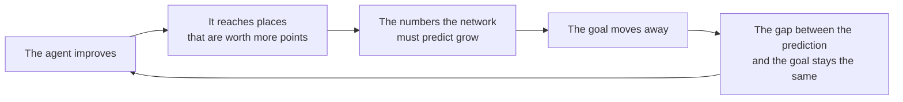
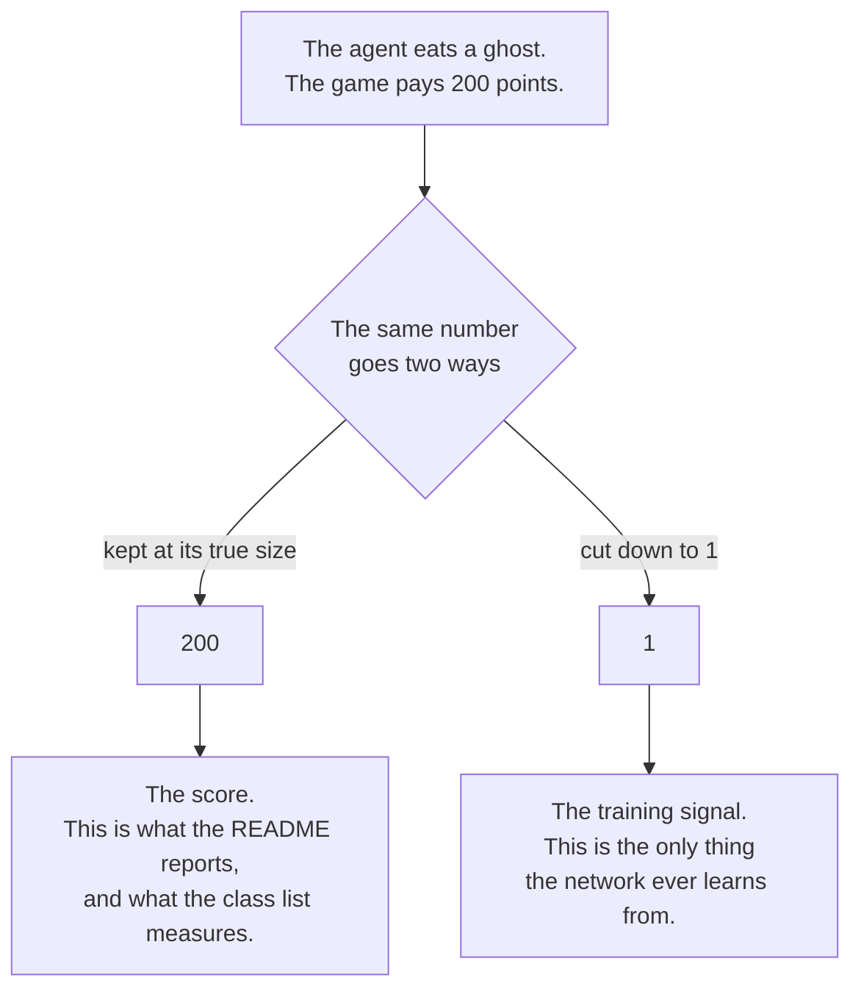
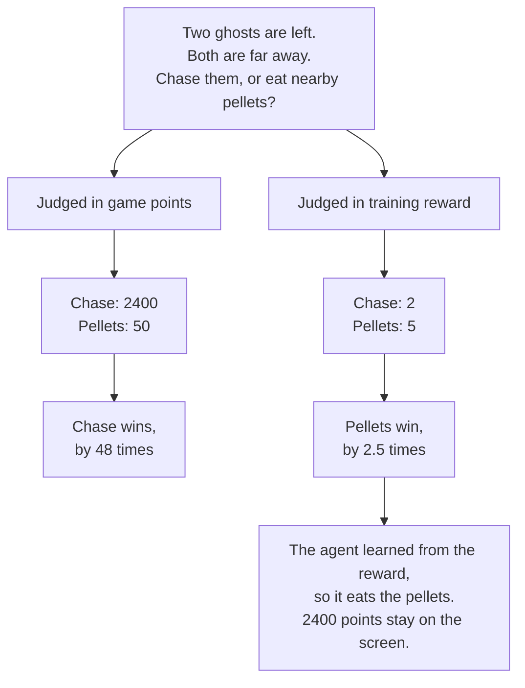
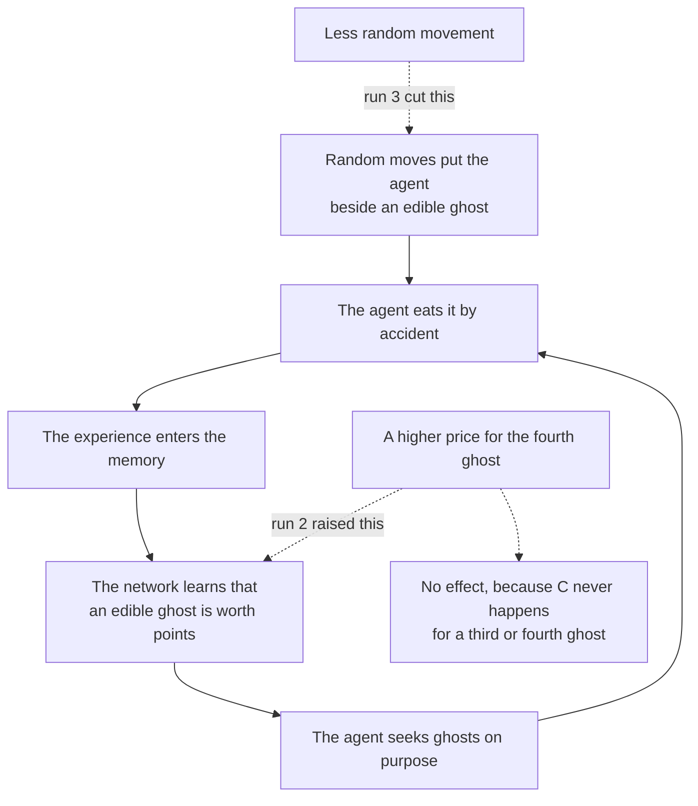

# Findings

This page gives the evidence behind each statement in the [README](README.md).

It answers three questions. What did the run show? What does the evidence not show? What did
the method itself teach?

Numbers from the first run come from the [`results/`](results/) folder. Numbers from the
second run come from [`results2/`](results2/). Each section names its source.

Numbers from the third run come from [`results3/`](results3/).

| Sections | Run | What changed | Average after six hours |
|---|---|---|---|
| 1 to 9 | Run 1 | The first run. Reward clipping, 15% exploration | 2578 |
| [10](#10-run-2-tested-the-answer-in-section-9-and-the-answer-was-wrong) | Run 2 | The reward rule kept the rewards in order | 2298 |
| [11](#11-run-3-lowered-the-exploration-rate-and-made-the-play-worse) | Run 3 | The exploration rate fell to 10% | 1748 |

[Section 12](#12-what-three-runs-show-together) gives the statement that the three runs
support together. It replaces the explanation in section 8.

The [README glossary](README.md#words-used-in-this-repository) explains the technical words.

---

## 1. The agent learned, and the result is not chance

The average score rose from 492 to 2578. That is an increase of 2086 points.

Five games is a small test. A small test can give a good result by chance. The check is to
compare the change with the distance between the five results.

| Measure | Value |
|---|---|
| Change in the average | +2086 |
| Distance between the five later results | 1060, from 2050 to 3110 |
| Results that improved | 5 of 5 |
| Lowest later result against highest earlier result | 2050 against 800 |

The change is about two times the distance. No later game scored less than any earlier game.
The two sets of results do not overlap at any point.

Source: `results/comparison.json`.

---

## 2. The prediction error never fell, and the agent still improved

This is the most useful finding for understanding what the error measures.

The course brief warns that a falling error does not prove better play. This run shows the
same lesson from the opposite side.

The error **rose** from 0.02 to about 0.13 in the first 100 games. It then stayed between 0.10
and 0.14 for the remaining 7500 games. It fell only a little at the end. In the same period
the score more than doubled.

| Games | Average score | Average error |
|---|---|---|
| 1 – 762 | 811 | 0.117 |
| 3049 – 3810 | 1453 | 0.120 |
| 6859 – 7620 | 1993 | 0.096 |

### Why the error stays level

The network is measured against a goal that it also produces.

The network predicts the points it expects. To build the goal, the program uses the network's
own prediction of the next position. A second, slower copy of the network supplies that
prediction. The program refreshes that copy every 1000 decisions.



The goal moves away as fast as the network approaches it. The error therefore stays about the
same, while the play improves.

Think of a person walking towards a horizon. The walker moves. The distance does not change.
That distance is the error. It says nothing about the progress of the walker.

**Do not read the error as a measure of progress.**

Source: `results/training.csv`, `results/training_dashboard.png`.

---

## 3. The agent survives longer, and also collects points faster

A higher score can have one dull explanation: the agent lives longer and eats the same pellets
more slowly. Two measurements rule that out.

| Measure | Before | After | Change |
|---|---|---|---|
| Decisions in one game | 589 | 976 | +66% |
| Game points for each decision | 0.84 | 2.64 | +214% |

If the agent had only learned to stay alive, the points for each decision would not change. It
rose by more than three times. The agent eats more, and it also lives longer.

Source: `results/comparison.json`.

---

## 4. The agent never reaches the time limit

No game reached the limit of 3000 decisions. This is true of the 5 games before training, the
5 games after training, and all 305 games recorded during training.

The longest game after training used 1018 of the 3000 decisions. That is about one third.

Every game ends because a ghost catches the agent. The time limit never stops a game. Avoiding
ghosts is therefore the limit on the score. It is also the part the reward teaches least well:
the agent receives no penalty when it loses a life, and the game continues. The only cost of
dying is the pellets it does not eat later. That signal is weak, and it arrives late.

Source: `results/comparison.json`, `results/demo_scores.json`.

---

## 5. The run was approaching its limit when it stopped

The score rose in all ten groups of games. The size of each rise became smaller.

| Group | Rise above the group before |
|---|---|
| 763 – 1524 | +222 |
| 3811 – 4572 | +217 |
| 5335 – 6096 | +124 |
| 6097 – 6858 | +38 |
| 6859 – 7620 | +31 |

The recorded games agree. The average was 2195 across games 5000 to 5250, and 2179 across
games 7375 to 7625. Those two figures are level, across the last 2600 games.

**This does not mean that more training is useless.** The run used 12.5% of the decisions in
the 2015 DQN paper. A limit at this point is more likely to come from the exploration rate or
from the reward, than from the method. Section 9 gives the test that separates the two.

Source: `results/training.csv`, `results/demo_scores.json`.

---

## 6. Three things written before the run were wrong

The prediction was written before the run. It is recorded in the history of this repository.

| Written before | What happened |
|---|---|
| The average rises above 492 | Correct. It reached 2578 |
| The five results lie far apart | Correct. They lie between 2050 and 3110 |
| At least one of five does not improve | **Wrong.** All five improved |
| The error may fall while the score does not rise | **Wrong.** The error stayed level while the score doubled |
| The agent does not hunt ghosts | **Wrong.** The agent hunts ghosts |

The last item was not a prediction. It was a statement about the method, and it appeared in an
earlier version of the README. Section 8 gives the measurement that disproved it, and the
corrected statement.

---

## 7. The computer was the limit, not the settings

The speed was measured before the run at between 62 and 169 decisions each second. The reason
for that difference was recorded as unknown. The note suggested the notebook software, or heat.

Neither was the cause. The computer had run for 30 days without a restart. Its memory store was
90% full, and only 0.1 GB was free. A restart cleared it. The run then held **288 decisions
each second**.

| Condition | Decisions each second |
|---|---|
| In the notebook, before the restart | 62 |
| In a clean process, before the restart | 169 |
| The real run, after the restart | **288** |

Two results follow.

1. **The restart gave more than any setting on the README.** It multiplied the training budget
   by between 1.7 and 4.6 times, for two minutes of work.
2. **The design of the limit absorbed the error.** At 288 decisions each second, an earlier
   plan of 8000 games would have finished at about 04:30, and the computer would have stood
   idle for two hours. The run used 38% of the 20000 limit, so the clock decided the length.

**The general lesson: measure the computer in the condition in which it will run.** A
measurement taken on a computer with a full memory store measures the full memory store, not
the work.

---

## 8. What the gameplay showed, and how the limitation changed

The measurements above show how much the agent scores. They do not show what it does. Two
questions needed the gameplay examined. Both are now answered, and the answer reversed the
limitation.

### Method

Each animation holds 75 pictures of the first 20 seconds of a game. Two things were read from
the pictures directly, not judged by eye.

1. **Edible ghosts.** An edible ghost uses the colour `RGB(66,114,194)`. That colour appears
   nowhere else in the animation. One ghost covers about 58 pixels. The count of those pixels
   therefore gives the number of edible ghosts on the screen.
2. **The score.** The score sits at the bottom of each picture. Number shapes were taken from
   one animation whose score was read by eye. Those shapes were then matched against every
   picture of the others.

A pellet pays 10 points. A power pellet pays 50. The four ghosts in one chain pay 200, 400,
800 and 1600.

### The agent learned to eat power pellets

The colour `RGB(66,114,194)` never appears in the untrained game. It never appears in the game
after 25 games. It appears in 41 of the 75 pictures after 7625 games.

Across the 305 games recorded during training, one every 25 games:

| Games | Recorded games with an edible ghost | Average pictures with an edible ghost, of 75 |
|---|---|---|
| 1 – 500 | 5% | 1.3 |
| 501 – 1500 | 50% | 12.6 |
| 1501 – 3000 | 90% | 26.6 |
| 3001 – 4500 | 98% | 36.5 |
| 4501 – 6000 | 100% | 37.8 |
| 6001 – 7625 | 98% | 38.5 |

The first recorded game with an edible ghost is game 125.

### The agent eats ghosts

The score proves it.

In the best test game the score goes from 140 to 190. That rise of 50 happens in the exact
picture in which the ghosts become edible. It is a power pellet. The score later goes from 320
to 530, a rise of 210. It then goes from 670 to 1070, a rise of 400.

The same pattern appears in the game recorded after 7625 games: 150 to 210 when the ghosts
become edible, then 520 to 770, then 770 to 1180.

A rise of 200 followed by a rise of 400 happens only when the agent eats two ghosts after one
power pellet.

### The agent never eats more than two

This is the finding that matters. These are all the ghost-sized rises in the last 12 recorded
games:

| Game | Rises caused by a ghost |
|---|---|
| 7350 | 200 |
| 7375 | 200, 400 |
| 7400 | 200 |
| 7425 | none |
| 7450 | 200 |
| 7475 | 200, 400 |
| 7500 | 200, 200 |
| 7525 | 200, 200 |
| 7550 | 200, 200 |
| 7575 | 200, 400 |
| 7600 | 200, 200 |
| 7625 | 200, 400 |

There is no 800 and no 1600 at any point. The agent eats one ghost, sometimes two, then stops.

Two rises of 200 come from two separate power pellets, with one ghost each. The doubling
starts again after each power pellet.

### Why this is the reward clipping, measured

> **Two later runs tested this explanation, and it did not hold.** The arithmetic below is
> correct: under clipping a full chain is worth less to the network than a line of pellets.
> Run 2 corrected that price and the agent still never ate a third ghost.
> [Section 12](#12-what-three-runs-show-together) gives the corrected explanation. This
> section is kept as it was written, because its arithmetic is still the reason the price is
> wrong, and because the test it led to is the test that settled the question.

The training loop sends the same number to two places. They are not the same number.



Three lines of the program make this split.

```python
next_obs, reward, ended, truncated, _ = train_env.step(action)
replay.add(obs, action, reward, ...)
score += reward
```

**Line 1.** The agent makes a move. The game answers with a new picture, and with the points
that the move earned. For a ghost, that is 200.

**Line 2.** The program writes the move into its memory. On the way in, it cuts the 200 down
to 1. The network learns only from this memory, so 1 is the only number it ever sees.

**Line 3.** The program adds the same 200 to the score, at full size. That score is the number
in this repository, and on the class list.

The four ghosts in a chain pay 200, 400, 800 and 1600 game points. After clipping, each is
worth exactly 1 to the network. One 10-point pellet is also worth 1.

Now price the real choice. Two ghosts remain, and both are far away. The journey costs about 20
decisions. In those decisions the agent could eat about five pellets instead.



| | Chase the two ghosts | Eat five pellets | Better choice |
|---|---|---|---|
| Game points | 2400 | 50 | Chase, by 48 times |
| Training reward | 2 | 5 | Eat pellets, by 2.5 times |

**Clipping does not reduce the reason to chase. It reverses it.** The two rows point in
opposite directions. Under the signal the agent received, leaving the chain is correct play.

The agent is correct for the instructions it was given. Those instructions disagree with the
measure used to grade it.

- The agent increases the count of scoring events.
- The class list measures the sum of game points.

These two aims have different best answers. A full chain is worth 3000 points. The agent
collects 200 to 600.

This is a disagreement between two aims, not a failure to learn. It is also the opposite of the
usual story. The agent did not find a trick to score absurdly high. It was told that a
1600-point ghost and a 10-point pellet are the same thing. It believed that. It now plays a
tidy pellet game, and it does not collect 2400 points that are available.

**The limitation written before the run was wrong.** It said the agent has no reason to eat
power pellets or chase ghosts, and would do neither. It does both. The correct statement is
narrower, and the evidence supports it: clipping does not stop the agent from eating ghosts, it
stops the agent from finishing the chain. A ghost nearby is cheap, and pays 1. A full chain is
expensive, and also pays 1.

This is a better limitation than the one predicted, because the gameplay produced it. The first
one came from reading the code.

---

## 9. The next experiment, and how to judge it

> **This experiment was run. The answer was wrong.** Run 2 made this change and did not
> improve the play. [Section 10](#10-run-2-tested-the-answer-in-section-9-and-the-answer-was-wrong)
> gives the result. This section is kept as it was written, because the test it names below
> is the test that decided the outcome.

**Replace reward clipping with a rule that keeps the order of the rewards. Change that one
setting only.**

Section 8 measured the gain this would release. Under clipping, the four ghosts in a chain and
one pellet are all worth 1. The agent answers by taking one or two ghosts, and it does not
collect 2400 points.

A square-root rule keeps large rewards small enough for safe training. A 1600-point ghost is
then worth 40 units, against 3.2 for a pellet. Finishing a chain becomes worth the journey.

The standard form of the rule is this:

```python
h(x) = sign(x) * (sqrt(abs(x) + 1) - 1) + 0.001 * x
```

The formula looks difficult. What it does is simple. It squashes big numbers towards small
ones, and leaves small ones almost unchanged. `sign(x)` keeps a penalty negative. The last
term stops the rule from losing information completely.

| Reward | Game points | After clipping, now | After the square-root rule |
|---|---|---|---|
| One pellet | 10 | 1 | 2.33 |
| First ghost | 200 | 1 | 13.38 |
| Fourth ghost | 1600 | 1 | 40.61 |

Clipping makes the fourth ghost equal to one pellet. The new rule makes it worth about 17
pellets. That is still far below the true 160 pellets, and that is the purpose. The numbers
stay small enough for safe training, and the order survives.

**Where this rule comes from.** Ape-X and R2D2 use this same function to avoid reward
clipping. They apply it to the value the network predicts, and put the reverse of the function
inside the training target. That is the more careful form, and it needs a change to `learn()`.
Applying the function to the reward is a one-line change, and it tests the same idea.

**How to know the answer is wrong.** If the trained agent still shows no rise of 800 or 1600,
then the reward rule is not the limit. The exploration rate is the next thing to examine.

### An alternative, if the change must be one of the three required settings

**Reduce the exploration rate during the run, from 1.0 to 0.05 across the first half.**

The rate stayed at 15% until the last game. The game also ignores one move in four. A large
share of late moves were therefore not the agent's choice.

The score rise per group fell from +222 early to +31 at the end. The recorded games were level
at about 2190 across the last 2600 games. A limit that arrives while one move in seven is still
random is the problem this change addresses.

**How to know the answer is wrong.** Run the same six hours with the new rate. If the score
stops rising at the same level, and after a similar number of games, then the limit is the
reward, and not the exploration rate.

---

## 10. Run 2 tested the answer in section 9, and the answer was wrong

Section 9 named one change, and it named the test that would prove the change wrong.
Run 2 made that change. The test says the answer was wrong.

### What changed, and what did not

One line of the program changed. The reward rule became the square-root rule that section 9
proposed.

```python
# Run 1
float(np.clip(reward, -1, 1))

# Run 2
float(np.sign(reward) * (np.sqrt(np.abs(reward) + 1.0) - 1.0) + 0.001 * reward)
```

Every other setting held at the run 1 value: 15% exploration, a ceiling of 20,000 games, a
learning rate of 0.0001, a memory of 50,000 steps, and the training seed 42. Both runs lasted
six hours.

The test conditions were untouched: the seeds 101, 202, 303, 404 and 505, 5% exploration, and
a cap of 3,000 decisions.

**The test proves it was untouched.** The five scores before training were identical in both
runs, seed for seed.

| | Seed 101 | Seed 202 | Seed 303 | Seed 404 | Seed 505 | Average |
|---|---|---|---|---|---|---|
| Run 1, before | 350 | 500 | 320 | 800 | 490 | 492 |
| Run 2, before | 350 | 500 | 320 | 800 | 490 | 492 |

Not only the same average. The same five numbers. Any difference after training therefore
comes from the training, and not from the test.

Source: `results/comparison.json`, `results2/comparison.json`.

### The prediction, written before the run

The prediction was committed to this repository at 00:48 on 13 September. The run started at
01:00.

| | The prediction | What happened | |
|---|---|---|---|
| 1 | The average goes above 3110 | 2298 | Wrong |
| 2 | The animations show rises of 800 and 1600 | No rise of 800 or 1600 in any test game | Wrong |
| 3 | The error is larger than 0.10 to 0.14, and does not fall | 0.48 to 0.51, and level | Correct |
| 4 | The rate stays near 288 decisions per second | 330 | Correct |

Items 3 and 4 confirm that the change worked as intended. The reward numbers grew, so the
error grew. The extra arithmetic cost almost nothing. The change did what it was designed to
do. It did not help the agent play.

### The result

| Measure | Run 1, clipping | Run 2, square root |
|---|---|---|
| Average before training | 492 | 492 |
| Average after six hours | **2578** | **2298** |
| The five scores after | 2790, 2330, 2610, 3110, 2050 | 1810, 2020, 2770, 2260, 2630 |
| Distance between the five | 1060 | 960 |
| Games completed | 7,628 | 9,269 |
| Decisions | 6,225,108 | 7,128,525 |

**Report this as no evidence of a difference.** The averages differ by 280. The five results
of each run are spread across about 1000 points. The difference is smaller than the spread,
so the correct statement is that run 2 does not show a difference. Run 2 scored lower on
three of the five seeds and higher on two.

It is wrong to call run 2 a small loss. It is also wrong to call it a near-match that needs
more time. Five games cannot separate two numbers this close.

Source: `results2/comparison.json`, `results2/training_summary.json`.

### The matched-games test, which was necessary

Run 2 ran at 330 decisions per second. Run 1 ran at 288. The machine was quieter for run 2,
because the applications that macOS reopened after a restart were closed first.

Six hours therefore bought run 2 about 15% more experience. The two runs are matched on time.
They are not matched on experience.

Both runs saved the network every 25 games, so both have a saved network at game 7,625. Those
two networks were tested against each other, on the same five seeds and the same settings.

| At game 7,625 | Seed 101 | Seed 202 | Seed 303 | Seed 404 | Seed 505 | Average |
|---|---|---|---|---|---|---|
| Run 1, clipping | 2580 | 2330 | 2700 | 2830 | 1070 | **2302** |
| Run 2, square root | 1840 | 1160 | 2280 | 1410 | 1610 | **1660** |

At equal experience the gap is 642, not 280, and run 2 is lower on four of the five seeds.
The extra experience was hiding part of the gap.

This is still inside the spread. The honest statement has two parts. There is no evidence
that the square-root rule helped. There is weak evidence that it hurt.

Source: `results2/matched_eval.json`, produced by `scripts/matched_eval.py`.

### The measurement that settles it

Section 9 wrote the test in advance:

> **How to know the answer is wrong.** If the trained agent still shows no rise of 800 or
> 1600, then the reward rule is not the limit. The exploration rate is the next thing to
> examine.

Section 8 read the score from the pictures of one animation, which shows the first 20 seconds
of one game. That method can miss a chain. This measurement cannot. The reward that the game
pays was recorded at every decision of all five test games.

The four ghosts of one chain pay 200, 400, 800 and 1600 points. A payment of 800 or 1600 is
therefore proof of a third or a fourth ghost.

| Payment | What it means | Run 1 | Run 2 |
|---|---|---|---|
| 50 | A power pellet | 20 | 19 |
| 200 | The first ghost | 12 | 9 |
| 400 | The second ghost | 4 | 3 |
| 800 | The third ghost | **0** | **0** |
| 1600 | The fourth ghost | **0** | **0** |

The ghosts eaten in each test game, in order:

| Seed | Run 1 | Run 2 |
|---|---|---|
| 101 | 200, 400, 200, 200 | 200, 200 |
| 202 | 200, 200, 200 | 200 |
| 303 | 200, 200, 200 | 200, 400 |
| 404 | 400, 200, 200, 400 | 200, 200, 400 |
| 505 | 200, 400 | 200, 200, 200, 400 |

Neither agent ever ate a third ghost. Run 2 ate 12 ghosts across the five games. Run 1 ate 16.
Both agents ate about the same number of power pellets, so both still take the pellet and then
stop short.

The square-root rule made the fourth ghost worth about 17 pellets to the network, in place of
one pellet. The behaviour did not change.

Source: `results2/reward_events.txt`, produced by `scripts/reward_events.py`.

### What this changes

**The reward scale is not the limit.** Section 8 argued from the code that clipping reverses
the reason to finish a chain, and the arithmetic in that section is still correct. Run 2 shows
that correcting the arithmetic is not sufficient. Something else stops the agent before the
third ghost.

The most likely cause is that the agent never sees the behaviour it is supposed to learn from.
A network learns from what its memory holds. A third ghost was eaten zero times in the test
games, and a chain is rare during training as well. A reward that is never received cannot
teach anything, whatever size it is given. The reward rule sets the price. It does not make
the agent walk to the shop.

That points at how the agent chooses to act, which is the exploration rate. Section 9 named
exploration as the next thing to examine, on its own criterion, before this run existed.

**Run 3 tested it, and the result was the opposite of the expected one.** Run 3 lowered the
exploration rate from 0.15 to 0.10. The play became worse, and the count of ghosts eaten fell
from 16 to 5. See [section 11](#11-run-3-lowered-the-exploration-rate-and-made-the-play-worse).
That result supports the explanation in this section, from the other direction: fewer random
moves produce fewer accidental ghost encounters, and fewer encounters produce less learning
about ghosts.

### What the method taught

This is the most useful part of run 2, and it does not depend on which setting wins.

Two runs of six hours each have now produced differences smaller than the spread across the
five test games. The test uses five games. The spread across those five games is about 1000
points. A test of this size cannot resolve a difference of 300, or even of 600.

Three consequences follow.

1. A single six-hour run cannot rank two settings that are close. It can only find a change
   large enough to clear the spread, as training itself does, at +2086.
2. The matched-games test is worth its cost. It made a 280 difference show as 642, because it
   removed a confound that the six-hour figures hide.
3. The reward-event count is worth more than either average. It answers a question about
   behaviour with a count of zero, and a count of zero needs no statistics.

**A falling number is not evidence, and neither is a rising one.** The course brief warns that
a falling error does not prove better play. Run 2 adds the matching warning for the score. A
higher average across five games does not prove a better agent, unless the rise is larger than
the spread between those games.

---

## 11. Run 3 lowered the exploration rate, and made the play worse

Section 10 named the exploration rate as the next thing to examine. Run 3 examined it.
The play became worse, and the measurement says why.

### What changed

One line changed against run 1. `EXPLORATION` went from 0.15 to 0.10. The reward rule
returned to `clip(reward, -1, 1)`, so run 3 differs from run 1 by one setting only.

The rate is one constant after the warm-up:

```python
epsilon = 1.0 if total_steps < WARMUP_STEPS else EXPLORATION
```

The test conditions were untouched again. The five scores before training were 350, 500, 320,
800 and 490 in all three runs.

Source: `results3/config.json`, `results3/comparison.json`.

### The result

| | Run 1 | Run 3 |
|---|---|---|
| Exploration | 0.15 | **0.10** |
| Reward rule | clipping | clipping |
| Average after six hours | **2578** | **1748** |
| The five scores | 2790, 2330, 2610, 3110, 2050 | 2080, 1640, 1530, 1790, 1700 |
| Distance between the five | 1060 | 550 |
| Games completed | 7,628 | 7,659 |
| Decisions | 6,225,108 | 6,083,408 |

### This result is not noise, and run 2 was

Section 10 reported run 2 as no evidence of a difference. Run 3 must be reported differently,
and the reason is the same test that section 1 used for run 1.

Section 1 called the training gain real because two conditions held. All five games improved,
and the two sets of five scores did not overlap. Run 3 against run 1 meets both conditions, in
the opposite direction.

| Test | Run 2 against run 1 | Run 3 against run 1 |
|---|---|---|
| Seeds that got worse | 3 of 5 | **5 of 5** |
| Range of the five scores | 1810 to 2770 | 1530 to 2080 |
| Range of run 1 | 2050 to 3110 | 2050 to 3110 |
| Overlap between the two sets | large | **30 points** |
| Games completed, against 7,628 | 9,269 | **7,659** |

Run 3 is lower on every seed. The two sets of scores almost do not touch. The games completed
are within 31 of run 1, so the experience confound that section 10 had to remove does not
exist here.

The matched test at game 7,625 agrees with the six-hour figure: run 1 scored 2302 and run 3
scored 1708.

**Lowering the exploration rate made the play worse.** That is the finding.

Source: `results3/comparison.json`, `results3/matched_eval.json`.

### The measurement that explains it

The reward the game paid was recorded at every decision of the five test games, for all three
trained networks.

| Payment | What it means | Run 1, 15% | Run 2, 15% | Run 3, **10%** |
|---|---|---|---|---|
| 50 | A power pellet | 20 | 19 | 20 |
| 200 | The first ghost | 12 | 9 | 5 |
| 400 | The second ghost | 4 | 3 | **0** |
| 800 | The third ghost | 0 | 0 | 0 |
| 1600 | The fourth ghost | 0 | 0 | 0 |
| | **Ghosts eaten in total** | **16** | **12** | **5** |

The ghosts eaten in each test game, in order:

| Seed | Run 1 | Run 3 |
|---|---|---|
| 101 | 200, 400, 200, 200 | 200, 200, 200 |
| 202 | 200, 200, 200 | none |
| 303 | 200, 200, 200 | none |
| 404 | 400, 200, 200, 400 | 200 |
| 505 | 200, 400 | 200 |

Two facts sit side by side.

1. **All three agents eat power pellets at the same rate.** 20, 19 and 20. The behaviour that
   starts a chain is unchanged.
2. **What happens next collapses.** Run 3 ate five ghosts in five games, and never ate a
   second ghost in any game.

Run 3 did not lose the power pellet habit. It lost the ghost habit.

Source: `results3/reward_events.txt`.

### One more sign that run 3 learned a narrower way to play

The agent is trained at its own exploration rate and tested at 5%. The change from one to the
other is a change in how much noise is in its moves.

| | Average of the last 500 training games | Average of the five test games | Change |
|---|---|---|---|
| Run 1, trained at 15% | 1978 | 2578 | **+600** |
| Run 3, trained at 10% | 1885 | 1748 | **−137** |

Run 1 and run 3 play about the same during training. They do not play the same when the noise
is removed. Run 1 gains 600 points when the random moves are taken away. Run 3 gains nothing.

This is a sign, not a proof. The two numbers are measured in different ways: the training
average covers 500 games with a network that is still changing, and the test average covers
five games with the final network. The direction is still clear, and it agrees with the ghost
count. Run 3 found a way to play that does not get better when it is allowed to follow its own
plan.

Source: `results/training.csv`, `results3/training.csv`, `results3/comparison.json`.

### The prediction, written before the run

The prediction was committed at 09:17 on 13 September. The run started at 10:30.

| | The prediction | What happened | |
|---|---|---|---|
| 1 | The average lands between 2600 and 3100 | 1748 | Wrong |
| 2 | The difference is smaller than the spread, so report no difference | The difference is larger, and it is a real difference | Wrong |
| 3 | At game 7,625 run 3 scores above 2302 | 1708 | Wrong |
| 4 | Run 3 completes fewer games than 7,628 | 7,659, which is 31 more | Wrong |

All four were wrong. The pre-written note on failure was right:

> Less exploration can also lock the agent into a routine it found early, so it never
> discovers the power pellet chains. If that happens the average falls below 2578 and the
> share of episodes scoring 3000 or more drops below the 3.3% of run 1.

The average fell to 1748. The share of training games scoring 3000 or more fell from 3.3% to
2.0%.

Item 4 deserves a note. The reasoning was that better play means longer games, so fewer games
fit into six hours. Run 3 did not play better, so the games did not lengthen. The prediction
failed because the assumption behind it failed, not because the arithmetic was wrong.

---

## 12. What three runs show together

Sections 8 and 9 explained the stop at two ghosts as a pricing problem. Under clipping a full
chain and one pellet are both worth 1, so the agent has no reason to finish the chain. The
arithmetic in section 8 is still correct. **It is not the reason the agent stops.**

Two experiments now say so.

| Run | The change | What it should have done | What happened |
|---|---|---|---|
| 2 | The chain was priced correctly | The agent finishes chains | No third ghost. Fewer ghosts than run 1 |
| 3 | Less random movement | The agent follows its plan better | No second ghost. One third of the ghosts of run 1 |

### The corrected statement

**The agent stops after one or two ghosts because it almost never experiences a chain, not
because a chain is worth too little.**

A network learns only from what its memory holds. The memory holds what the agent did. Run 2
raised the price of an experience that the memory does not contain, and a price cannot teach
an experience that is never received. Run 3 reduced the random movement that produces those
experiences by accident, and the count of ghosts eaten fell with it.



The loop starts with an accident. Run 2 changed the value of the last step in the loop. Run 3
made the first step rarer. Only one of those two can stop the loop, and it is the first one.

### The evidence in one table

| | Run 3 | Run 1 | Run 2 |
|---|---|---|---|
| Exploration | 0.10 | 0.15 | 0.15 |
| Power pellets eaten, five games | 20 | 20 | 19 |
| Ghosts eaten, five games | 5 | 16 | 12 |
| Average of the five test games | 1748 | 2578 | 2298 |

The count of power pellets does not move. The count of ghosts moves with the exploration rate.
The score follows the ghosts.

### What this does not show

Three runs give three points, and two of them share the same exploration rate. This supports
the statement. It does not prove it.

The clean test is the other direction, and it has not been run. **Raise the exploration rate
above 0.15 and count the ghosts.** If the count rises above 16, the statement holds. If the
count does not rise, then something else limits the chain, and the exploration rate only
appeared to matter because 0.10 is too low for a reason of its own.

That test is described in [section 13](#13-the-next-experiment-and-how-to-judge-it).

---

## 13. The next experiment, and how to judge it

> **This run is scheduled.** Run 4 trains from 00:00 to 06:00 on 14 September at an
> exploration rate of 0.25. The prediction was committed before the run started, and it names
> the ghost count as the measure, not the score. Full prediction:
> [`docs/ai-log/DECISIONS.md`](docs/ai-log/DECISIONS.md).

**Raise the exploration rate from 0.15 to 0.25. Change that one setting only.**

Section 12 says the limit is the number of chains the agent experiences, and that random
movement is what produces them. Runs at 0.10 and 0.15 give two points, and the ghost count
rose from 5 to 16 between them. A third point above 0.15 tests whether the relation continues.

**Judge it on the ghost count first, and on the score second.** These two can disagree, and
the disagreement is the useful part.

| Ghost count | Score | What it means |
|---|---|---|
| Rises above 16 | Rises above 2578 | The statement holds, and more exploration is also better play |
| Rises above 16 | Falls below 2578 | The statement holds. Random moves also cost lives, and the cost is larger than the gain |
| Stays near 16 or falls | Either | The statement is wrong. The exploration rate is not what limits the chain |

The middle row is the likely one, and it would still confirm section 12. More random movement
produces more accidental ghost encounters, and it also walks the agent into ghosts that are
not edible. A result that raises the ghost count while lowering the score separates the
mechanism from the score, which no run so far has done.

**How to know the answer is wrong.** If the ghost count does not rise at 0.25, the encounter
explanation fails. The next candidates are the length of training, because a chain may need
more than six hours to appear, and the rule that updates the network, because a rare event
needs to be replayed more often than a common one to be learned from.
