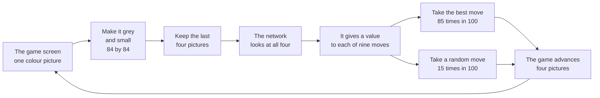
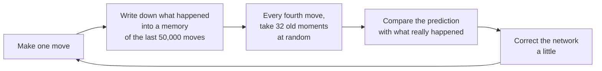
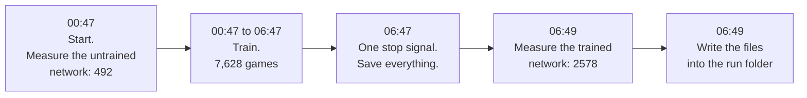
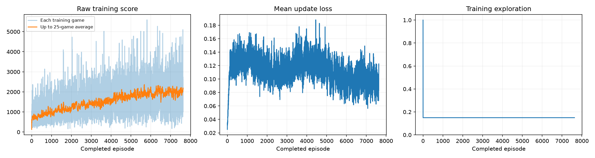
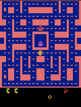
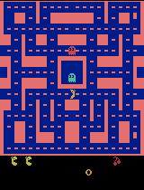
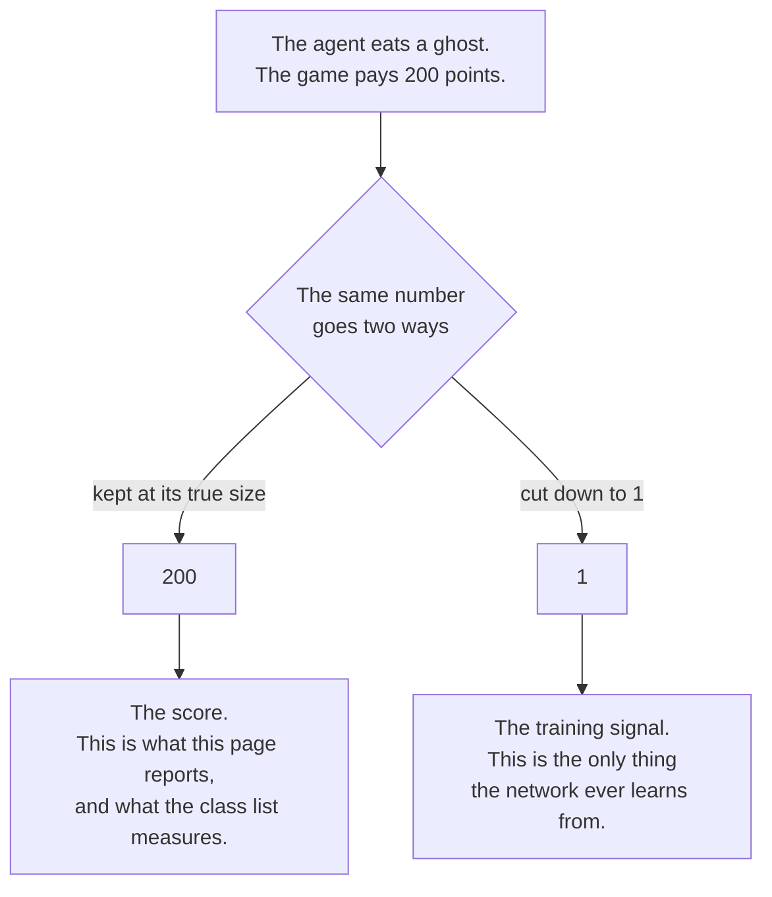
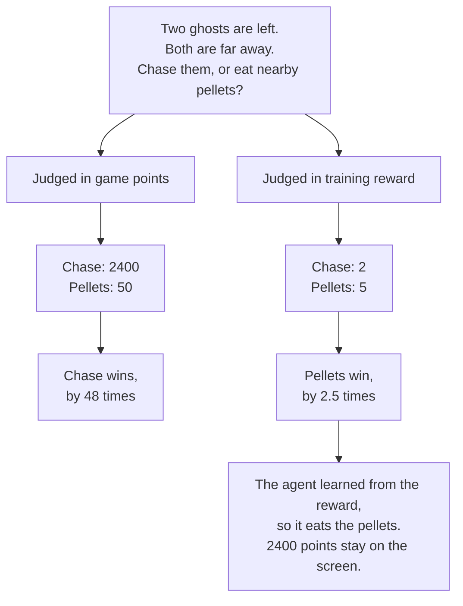

# Ms. Pac-Man DQN — Fundamentals of Agentic AI, Class 3

## What this is

This repository holds a computer program that learned to play Ms. Pac-Man.

Nobody told the program the rules. It did not receive a strategy. It played the game many
times. It kept the moves that gave points. It removed the moves that gave no points. After
six hours it played the game about five times better than when it started.

This page explains what happened. It uses plain words. The section
[Words used in this repository](#words-used-in-this-repository) explains each technical term.

The program is a Deep Q-Network, or DQN. The notebook comes from the class repository
[pepealonso95/pacman-dqn](https://github.com/pepealonso95/pacman-dqn).

## The result

The program played five test games before training, and the same five games after training.
The test conditions were identical both times.

| | Average score, five games |
|---|---|
| Before training | 492 |
| After training | **2578** |

The score increased by 2086 points. That is 5.2 times the first score. The program improved
in all five test games. [The full table is below](#the-five-test-games).

## Short answers

Each answer links to the full evidence.

**Did the program learn to play?**
Yes. The average score rose from 492 to 2578. That is 5.2 times better.

**Could that be luck?**
No. All five test games improved. The change in the average, 2086, is about two times the
distance between the five results, 1060. The lowest score after training beats the highest
score before training. The two sets do not overlap. See [The five test games](#the-five-test-games).

**What does the program do better?**
Two things at once. It lives 66% longer, and it collects 3.1 times more points in each
decision. It is not only staying alive for longer.

**Did it learn the advanced strategy of the game?**
Half of it. The advanced strategy is to eat a power pellet, then eat all four ghosts. The
program learned to eat power pellets, in 100% of its late games. It eats ghosts. **It never
eats more than two.** See [What the agent learned that I did not expect](#what-the-agent-learned-that-i-did-not-expect).

**Why does it stop at two ghosts?**
Because of how it was rewarded. The four ghosts pay 200, 400, 800 and 1600 game points. The
program does not learn from game points. Each ghost is worth 1 to it, and so is one small
pellet. Walking across the maze for the last ghost pays what one nearby pellet pays. See
[One limitation](#one-limitation).

**Did the prediction error fall during training?**
No. It stayed level for the whole run, while the score more than doubled. A level error does
not mean a level program. See [The training chart](#the-training-chart).

**How long did the run take?**
Six hours. It played 7,628 games, made 6,225,108 decisions, and corrected the network
1,556,027 times. See [What the run cost](#what-the-run-cost).

**What settings did you select?**
Exploration 0.15, a limit of 20000 games, and a learning rate of 0.0001. I also raised the
memory from 5000 to 50000 experiences, and turned off the popup windows. See
[The settings I chose, and why](#the-settings-i-chose-and-why).

**Which of your reasons is weakest?**
The exploration rate of 0.15. I selected the value between the default and the value I first
argued for. I did not test it.

**What did you get wrong?**
Three things, and all three were wrong in a good direction. I expected one of the five games
not to improve, and all five improved. I expected the error to fall while the score stayed
level, and the opposite happened. I stated that the program would never chase ghosts, and it
chases ghosts. See [What I expected, and what happened](#what-i-expected-and-what-happened).

**What would you change next?**
The reward rule. Replace the rule that makes every event worth 1 with a square-root rule that
keeps large rewards larger. See [One next experiment](#one-next-experiment).

**What helped the most?**
A restart of the computer. It had run for 30 days, and its memory store was 90% full. After
the restart the program ran at 288 decisions each second, against 62 to 169 before. That gave
more than any setting on this page.

**Why is the notebook an empty page on GitHub?**
The file is 14.6 MB, and the GitHub viewer cannot show a file of that size.
**[Use this link instead.](https://nbviewer.org/github/patronofalltrades/PacMan-Fundamentals-of-Agentic-AI/blob/main/pacman_dqn.ipynb)**

## How to read this repository

Start with this page. It contains the complete explanation.

| File or folder | What it contains | Who needs it |
|---|---|---|
| `README.md` | This page. The full explanation and all results | Every reader |
| `FINDINGS.md` | A longer analysis. It gives the evidence for each statement here | A reader who wants proof |
| `CLASS_NOTES.md` | One page of speaking notes for the class presentation | Me, in class |
| `pacman_dqn.ipynb` | The program, with the output of the real run. **[Read it here](https://nbviewer.org/github/patronofalltrades/PacMan-Fundamentals-of-Agentic-AI/blob/main/pacman_dqn.ipynb)** | A reader who wants the code |
| `results/` | The measurements from the run | A reader who wants the raw data |
| `results/demos/` | 307 short animations of the program playing | Every reader |
| `scripts/` | Two small helper programs used to control the run | A reader who repeats the run |
| `requirements.txt` | The list of software the notebook needs | A reader who repeats the run |

## Read the program and its results

### **[Open pacman_dqn.ipynb in nbviewer](https://nbviewer.org/github/patronofalltrades/PacMan-Fundamentals-of-Agentic-AI/blob/main/pacman_dqn.ipynb)**

The notebook is [`pacman_dqn.ipynb`](pacman_dqn.ipynb) in this repository. It contains the
output of the real run.

**GitHub shows this file as an empty page.** The file is 14.6 MB, because it contains 307
animations. The GitHub viewer cannot show a file of that size. The link above shows the same
file correctly. Nothing was removed from the file.

## What the program does, in plain words

### One cycle, from picture to move



The agent repeated this cycle 6,225,108 times during the run.

### What it sees

The program sees the game screen, and nothing else. It does not read the memory of the game.
It does not know where the ghosts are. It only receives pictures.

The computer changes each picture to grey, and makes it small: 84 pixels by 84 pixels. The
program receives the last four pictures together. One picture does not show movement. Four
pictures show movement.

### What it can do

The program selects one of nine moves. The moves are: no move, up, down, left, right, and
the four diagonal moves.

One move in four does not obey the program. The game repeats the previous move instead. This
is a setting of the game. It makes the game less predictable.

### How it receives points

The game gives points. Pellets, power pellets, ghosts and fruit all give points.

**Important: the program does not learn from game points.** Each event that gives points
counts as 1 during training, whatever its size. The section
[One limitation](#one-limitation) explains why this matters.

### How it learns

A neural network reads the four pictures. It predicts a value for each of the nine moves.
The value is the points the program expects if it makes that move.



The program does not learn from the move it just made. It learns from 32 old moments, taken at
random from its memory. Moments that follow each other are too similar, and a network that
learns from them alone learns badly.

The program made 1,556,027 corrections during the run.

## Words used in this repository

Each word below has one meaning only. The last column gives the name in the program code.

### The program

| Word | What it means | In the code |
|---|---|---|
| Agent | The program that plays the game | The network and `choose_action` |
| Network | The part of the agent that predicts. It holds about 1.69 million numbers | The class `DQN` |
| DQN | Deep Q-Network. The method. DeepMind published it in 2015 | The class `DQN` |
| Q-value | The points the network expects from one move | The nine numbers from `model(screens)` |
| Weights | The numbers inside the network. Training changes them | About 1.69 million numbers |
| Policy | The rule that selects a move | `choose_action` |
| Greedy move | The move with the highest expected points | `model(screens).argmax()` |
| Target network | A second, slower copy of the network. It stops the goal from moving too fast | `target`, copied every 1000 decisions |

### Training

| Word | What it means | In the code |
|---|---|---|
| Decision | One move of the agent. The game advances four pictures for each decision | One pass of the inner loop |
| Episode | One complete game. It ends at game over, or at 3000 decisions | `MAX_STEPS = 3000` |
| Update | One correction to the network. The run made 1,556,027 | One call to `learn()` |
| Experience replay | The store of past experience. The agent learns from random old moments | The class `ReplayMemory` |
| Batch | The group of 32 experiences in one update | `BATCH_SIZE = 32` |
| Warm-up | The first 1000 decisions. The agent moves at random and does not learn | `WARMUP_STEPS = 1000` |
| Exploration | The share of moves the agent selects at random. Also called epsilon | `EXPLORATION`. I set 0.15 |
| Learning rate | The size of each correction | `LEARNING_RATE = 0.0001` |
| Loss | A number that measures the size of the prediction error | The result of `learn()` |
| Game points | The score the game shows. This README reports these | `score += reward` |
| Training reward | The signal the network learns from. Always 1, -1 or 0 | `np.clip(reward, -1, 1)` |
| Reward clipping | The rule that makes every scoring event worth 1 | `np.clip(reward, -1, 1)` in `ReplayMemory.add` |

### The game

| Word | What it means | In the code |
|---|---|---|
| Frame | One picture from the game. The game makes 60 each second | The output of the emulator |
| Frame skip | The game advances four pictures for each decision | `FRAME_SKIP = 4` |
| Frame stack | The four recent pictures the agent sees together | `stack_size=4`, shape `(4, 84, 84)` |
| Sticky actions | The game repeats the previous move one time in four | `repeat_action_probability=0.25` |
| Power pellet | The large pellet. It makes the ghosts edible for a few seconds | Part of the game |
| Ghost chain | The four ghosts eaten after one power pellet. They pay 200, 400, 800 and 1600 points | Part of the game |
| Seed | A number that fixes a random sequence. The same seed gives the same game | `SEED = 42`, `EVAL_SEEDS` |
| Baseline | The score of the untrained network. It is 492 | `baseline.json` |
| Evaluation | Five complete games with fixed settings, before and after training | `evaluate()` |
| MPS | The interface that lets the program use the graphics chip of an Apple computer | The selected device |

## The settings I chose, and why

The assignment lets the student select three settings. I changed two more settings, and I
give the reason for each.

### The three required settings

| Setting | Default | My value | Why |
|---|---|---|---|
| Exploration | 0.20 | **0.15** | This value is between the default and the 0.10 I first argued for. I changed four settings at the same time. I held this one near the default, to limit how much moved at once. **This is my weakest reason. I did not test it.** |
| Episodes | 100 | **20000** | This is a limit I did not expect to reach. The clock ends the run, not the number of games. See below |
| Learning rate | 0.0001 | **0.0001** | Unchanged. This is the standard value for this optimiser. A long run needs steady progress more than fast progress |

### The two extra settings

| Setting | Default | My value | Why |
|---|---|---|---|
| Replay capacity | 5000 | **50000** | The memory of 5000 experiences holds about eight recent games. The agent then learns from a narrow and repetitive set of moments, and forgets early experience in minutes. The cost is 1.7 GB of memory and less than 3% of speed |
| Popup windows | on | **off** | This stops a window from opening during an unattended night run. The animations are still recorded. This changes the display only |

### The settings I did not change

The test conditions are fixed, so this result is comparable with the rest of the class. The
test uses the same five seeds (101, 202, 303, 404, 505), 5% exploration, and the same
3000-decision limit. It runs before training and after training, without any change. The
first score comes from an untrained network, not from a program that moves at random.

### Why the number of games is a limit and not a target

The speed of the computer was uncertain before the run. The measurements gave between 62 and
169 decisions each second. That is a difference of 2.7 times. The length of a game also grows
as the agent improves. No number of games therefore gives a run of a known length.

I fixed the length instead. I set the limit to 20000 games, which neither speed can reach. The
run started at 00:47. A small program sent one stop signal at 06:47. The notebook receives that
signal, records the run as `interrupted`, and saves everything.

**The measurement was wrong, and the limit absorbed the error.** The run reached 288 decisions
each second. The computer had run for 30 days without a restart, and its memory was 90% full.
I restarted it before the run. The speed then almost doubled. At 288 decisions each second, an
earlier plan of 8000 games would have finished at about 04:30 and wasted two hours. The run
used 38% of the 20000 limit, so the clock decided the length, as intended.

## How I controlled the run

```sh
.venv/bin/python -m jupyter lab pacman_dqn.ipynb   # then Run All
./scripts/stop_training_at.sh 06:47                # in a second terminal
```



[`scripts/stop_training_at.sh`](scripts/stop_training_at.sh) finds the running program. It
keeps the computer awake. It waits until the set time. It then sends one stop signal. It sends
nothing if the run has already finished, because a stop signal would then damage the test.

The first and last steps use identical conditions. That is what makes 492 and 2578 comparable.

## What I expected, and what happened

**I wrote this before the run started.** The record is in the history of this repository.

**What I expected.** The average score rises above 492. The five results are far apart. At
least one of the five does not improve. The agent moves toward pellets and clears corridors.
It does not hunt ghosts. The prediction error may fall while the score does not rise.

**What happened.** The average rose from 492 to 2578. Three parts of the prediction were
wrong, and all three were wrong in a good direction.

| I expected | What happened |
|---|---|
| At least one of five does not improve | All five improved |
| The error may fall while the score does not rise | The error stayed level while the score more than doubled |
| The agent does not hunt ghosts | **The agent hunts ghosts** |

The third item was not a prediction. It was a statement I made about the method, and the
gameplay disproved it. The section [One limitation](#one-limitation) gives the corrected
statement. The correction is the most useful thing in this repository.

## Results

### The five test games

The same five seeds, 5% exploration, and the same 3000-decision limit, before and after.

| Game | Seed | Before | After | Change |
|---|---|---|---|---|
| 1 | 101 | 350 | 2790 | +2440 |
| 2 | 202 | 500 | 2330 | +1830 |
| 3 | 303 | 320 | 2610 | +2290 |
| 4 | 404 | 800 | 3110 | +2310 |
| 5 | 505 | 490 | 2050 | +1560 |
| **Average** | | **492** | **2578** | **+2086** |

Full data: [comparison.json](results/comparison.json).

**This result is not an accident of chance.** A small number of games can give a result by
chance. The test for that is simple: compare the change with the distance between the five
results.

- The change in the average is 2086.
- The five results after training lie between 2050 and 3110. That distance is 1060.
- The change is about two times the distance.

Every one of the five improved. The lowest score after training, 2050, is higher than the
highest score before training, 800. The two sets of results do not overlap at any point.

**The first score of 492 is exact and repeatable.** The notebook fixes the random sequence
before it builds the network. Any person who runs the notebook without changes receives 350,
500, 320, 800 and 490. A program that moves at random scores about 237, which is a different
and lower number.

### The agent survives longer, and also collects points faster

A higher score can mean one thing only: the agent lives longer. That is not what happened.

| | Before | After |
|---|---|---|
| Decisions in one game | 589 | 976 |
| Game points for each decision | 0.84 | 2.64 |

The agent lives 66% longer. It also collects 3.1 times more points in each decision. It does
both things, not one of them.

### The agent still dies in every game

No test game reached the 3000-decision limit, before training or after. The longest game after
training used 1018 decisions of the 3000 allowed. Of the 306 games recorded during training,
not one reached the limit.

Every game ends because a ghost catches the agent. Avoiding ghosts is therefore the limit on
the score.

### The training chart



**Read the left panel, not the middle one.**

The left panel shows the score. The orange line is the average of the last 25 games. It rises
steadily from about 700 to about 2100. The pale blue line is each single game. Single games
vary between almost nothing and 5600, which is why the average matters.

The middle panel shows the prediction error. **The error did not fall.** It rose from 0.02 to
about 0.13 in the first 100 games. It then stayed between 0.10 and 0.14 for the rest of the
run. In the same period the score more than doubled.

A level error did not mean a level agent. [FINDINGS.md](FINDINGS.md) section 2 explains why.
The short answer: the network is measured against a goal that it also produces. As the agent
reaches better positions, the goal moves away as fast as the network approaches it.

The right panel shows exploration. It is 100% for the first 1000 decisions, then a level 15%
until the end. There is no reduction over time.

### The score during training

These games use 15% exploration, so they are not comparable with the test games above. The
direction is the useful part.

| Games | Average score | Average decisions | Average error |
|---|---|---|---|
| 1 – 762 | 811 | 631 | 0.117 |
| 763 – 1524 | 1033 | 693 | 0.128 |
| 1525 – 2286 | 1209 | 739 | 0.115 |
| 2287 – 3048 | 1345 | 771 | 0.111 |
| 3049 – 3810 | 1453 | 806 | 0.120 |
| 3811 – 4572 | 1670 | 852 | 0.126 |
| 4573 – 5334 | 1800 | 888 | 0.116 |
| 5335 – 6096 | 1924 | 925 | 0.100 |
| 6097 – 6858 | 1962 | 924 | 0.099 |
| 6859 – 7620 | 1993 | 932 | 0.096 |

The score rises in every group. The length of a game rises in every group but the last.

The increase becomes smaller near the end: +222 in the second group, and +31 in the last. The
run was approaching its limit when it stopped. Full data: [training.csv](results/training.csv).

### The gameplay

**Before training:**


**After training. This is the best of the five test games, at 3110 points:**



**The change during training.** The program recorded one game every 25 games. All 307
animations are in [results/demos/](results/demos/).

| After 25 games | After 250 | After 1000 |
|---|---|---|
|  |  |  |

| After 2500 | After 5000 | After 7625 |
|---|---|---|
|  |  |  |

The average score of these recorded games:

| Games | 25–250 | 1000–1250 | 2500–2750 | 5000–5250 | 7375–7625 |
|---|---|---|---|---|---|
| Score | 530 | 933 | 1474 | 2195 | 2179 |
| Decisions | 584 | 637 | 833 | 856 | 931 |

The best single recorded game scored 5140, at game 5225. The last two groups are level, which
agrees with the table above.

Each animation plays at four times normal speed. It shows the first 20 seconds of the game.

### What the run cost

| | |
|---|---|
| Status | **Interrupted**, by design, at 06:47 after six hours |
| Games completed | 7,628 of a 20,000 limit |
| Decisions | 6,225,108 |
| Corrections to the network | 1,556,027 |
| Time | 6.00 hours |
| Speed | 288 decisions each second |
| Compared with the 2015 DQN paper, which used 50 million decisions | 12.5% |
| Computer | Apple M5, 16 GB memory, MPS |
| Software | Python 3.13.15, torch 2.14.0, gymnasium 1.3.0, ale-py 0.11.2, macOS 26.4.1 |

One stop signal at a set time ended the run. The number of games did not end it. This is a
stated limit of the run, not a fault. The notebook receives the signal, records the run as
`interrupted`, and saves the network, the measurements and the chart before the test starts.

Executed notebook: **[open in nbviewer](https://nbviewer.org/github/patronofalltrades/PacMan-Fundamentals-of-Agentic-AI/blob/main/pacman_dqn.ipynb)**

Full records: [config.json](results/config.json) ·
[training.csv](results/training.csv) ·
[training_summary.json](results/training_summary.json) ·
[demo_scores.json](results/demo_scores.json) ·
[comparison.json](results/comparison.json)

A longer analysis is in [FINDINGS.md](FINDINGS.md).

**One message in the notebook is not an error.** The software install cell prints
`No module named pip`. The environment was built with a different tool, which does not install
`pip`. All the software was already present. The cell below it lists the versions.

## What the agent learned that I did not expect

I stated that the agent would never eat a power pellet and then chase the ghosts. The
gameplay disproved that statement.

A power pellet makes the four ghosts edible for a few seconds. If the agent eats all four in
that time, they pay 200, 400, 800 and 1600 game points. That is 3000 points in total. The
value is in finishing: the last two ghosts hold 2400 of the 3000.

I measured the animations directly, picture by picture. An edible ghost uses one exact colour
that appears nowhere else. I counted that colour. I also read the score from the bottom of
each picture.

**The agent learned to eat power pellets.**

| Games | Share of recorded games in which the agent ate a power pellet |
|---|---|
| 1 – 500 | 5% |
| 501 – 1500 | 50% |
| 1501 – 3000 | 90% |
| 3001 – 4500 | 98% |
| 4501 – 6000 | **100%** |
| 6001 – 7625 | 98% |

The first time was game 125. After game 4500, the agent ate a power pellet in the first 20
seconds of almost every game.

**The agent eats ghosts.** The score shows it. In the best test game the score rises by 50
when the ghosts become edible, then by 200, then by 400. Two ghosts eaten, one after the
other.

**The agent never eats more than two.** [One limitation](#one-limitation) explains this.

## One limitation

**Reward clipping does not stop the agent from eating ghosts. It stops the agent from
finishing the chain.**

### What the evidence shows

I read the score of the last 12 recorded games. Every increase caused by a ghost was 200 or
400. There was no 800 and no 1600.

The agent eats one ghost, sometimes two, then stops. It collects 200 to 600 points from a
power pellet that is worth 3000.

### Why this happens

**The program does not learn from game points.** There are two different numbers, and they
follow two different paths.



This split happens in two lines of the program. Here they are, with what each line does.

```python
next_obs, reward, ended, truncated, _ = train_env.step(action)
replay.add(obs, action, reward, ...)
score += reward
```

**Line 1.** The agent makes a move. The game answers. It returns a new picture, and the points
that the move earned. For a ghost, those points are 200.

**Line 2.** The program writes the move into its memory. On the way in, it cuts the 200 down to
1. The network later learns from this memory, so 1 is the only number it ever sees.

**Line 3.** The program adds the same 200 to the score, at its true size. This score is what
this page reports.

One event. Two numbers. The reader sees 200. The network sees 1.

| | Game points | Training reward |
|---|---|---|
| One pellet | 10 | 1 |
| One power pellet | 50 | 1 |
| The four ghosts in a chain | 200, 400, 800, 1600 | 1, 1, 1, 1 |

**The network never sees a game point.** It counts events. It cannot know that one ghost is
worth 160 pellets.

Now look at the choice the agent makes. Two ghosts remain, and both are far away. The journey
costs about 20 decisions. In those decisions the agent could eat about five pellets instead.



| | Chase the two ghosts | Eat five pellets | Better choice |
|---|---|---|---|
| In game points | 2400 | 50 | Chase, by 48 times |
| In training reward | 2 | 5 | Eat pellets, by 2.5 times |

**Clipping does not reduce the reason to chase. It reverses it.** The two rows point in
opposite directions. Under the signal the agent received, leaving the chain is the correct
move.

**The agent did not fail to learn. It learned its instructions exactly. The instructions are
wrong about the value of the game.**

### Why the method does this

Reward clipping is not a fault in the notebook. It comes from the 2015 DQN paper. That paper
trained one design, with one set of settings, on 49 different games. The scores of those games
differ by thousands of times. Clipping makes them comparable.

It also protects the training. A reward of 1600 would make one very large correction, and that
correction can destroy the network. Clipping prevents this.

Clipping buys generality and safety. It pays for them in accuracy.

### A second limitation

The agent receives no penalty when it loses a life, and the game does not end. The only cost
of dying is the pellets it does not eat later. That signal is weak, and it arrives late. Every
game ends in death, as the section above shows. Avoiding ghosts is the part the instructions
teach least well.

Full method and numbers: [FINDINGS.md](FINDINGS.md), section 8.

## One next experiment

**Replace reward clipping with a rule that keeps the order of the rewards. Change that one
setting only.**

A square-root rule is the standard choice. It shrinks large numbers, but it keeps them in
order. Clipping does not keep them in order: it makes every number the same.

```python
h(x) = sign(x) * (sqrt(abs(x) + 1) - 1) + 0.001 * x
```

The formula looks difficult. What it does is simple. It is a rule that squashes big numbers
towards small ones, and leaves small ones almost unchanged. `sign(x)` keeps a penalty negative.
The last term stops the rule from losing information completely.

Compare the three ways to treat the same four rewards:

| Reward | Game points | After clipping, now | After the square-root rule |
|---|---|---|---|
| One pellet | 10 | 1 | 3.2 |
| First ghost | 200 | 1 | 14.2 |
| Fourth ghost | 1600 | 1 | 40.0 |

Clipping makes the fourth ghost equal to one pellet. The square-root rule makes it worth about
12 pellets. That is still less than the true 160 pellets, and that is the point: the numbers
stay small enough for safe training, but the order survives. Finishing a chain then becomes
worth the journey.

This is not a new idea. Two well-known systems, Ape-X and R2D2, use this rule for this exact
purpose.

**How I would know I was wrong.** Run the same six hours with the new rule. If the score still
shows no increase of 800 or 1600, then clipping is not the limit. The next thing to examine
would be the exploration rate.

**An alternative, if the change must be one of the three required settings.** Reduce the
exploration rate during the run, from 1.0 to 0.05 across the first half. The rate stayed at
15% until the last game, and the game ignores one move in four as well. The score increase per
group fell from +222 to +31, and the recorded games were level across the last 2600 games. A
limit that arrives while one move in seven is still random is the problem this change
addresses.

## How to repeat this run

**On a Mac or a Linux computer:**

```sh
git clone https://github.com/patronofalltrades/PacMan-Fundamentals-of-Agentic-AI.git
cd PacMan-Fundamentals-of-Agentic-AI
uv venv --python 3.13 .venv          # or: python3.13 -m venv .venv
VIRTUAL_ENV=.venv uv pip install -r requirements.txt ipykernel
.venv/bin/python -m jupyter lab pacman_dqn.ipynb
```

Select the `.venv` kernel. Then select Run All. The notebook finds the graphics chip without
help. It uses CUDA, Apple MPS, or the main processor.

**In Google Colab:** open the notebook. Select Runtime, then Change runtime type, then T4
GPU. Then select Runtime, then Run all. The first cell installs the software.

**Before a long run, restart the computer.** This run reached 288 decisions each second after
a restart. It reached 62 to 169 before one. The restart gave more than any setting on this
page.

## Assignment objectives

This section restates the course brief.

**The task.** Use the supplied notebook to train a Deep Q-Network on Ms. Pac-Man. Select three
settings. Train the agent. Explain what it learned. Submit one public repository address.

### The three settings the student selects

| Setting | What it is | Starting point |
|---|---|---|
| Exploration | A number between 0 and 1. A value of 0.20 makes about 20% of training moves random | 0.20 |
| Episodes | The number of training games | 100 |
| Learning rate | The size of each correction | 0.0001 |

The exploration rate stays the same after the first 1000 random moves. A game ends at game
over, or at the time limit. The student may change other settings, but must explain each
change.

### Fair measurement

Keep the test settings unchanged: the same five seeds, 5% exploration, and the same time
limit, before and after training. Report every score and both averages. The first score comes
from an untrained network, not from a program that moves at random. Watch the animations as
well as the scores. A lower prediction error does not prove better play. Report runs that fail,
and runs that do not improve.

### What this page must contain

- A short introduction, and instructions to open and run the notebook.
- The three settings, each with a short reason.
- What the student expected, then what the student observed.
- The games completed, the decisions, the corrections, the time, and the computer used.
- An explanation in plain words: four pictures are what the agent sees, joystick moves are what
  it can do, and game points give the reward.
- One limitation, and one next experiment. Name the single setting to change, and why.

### What evidence this page must show

- The animation before training, the best animation after training, and the animations between.
- The training chart, so the score, error and exploration are visible.
- A table with all five first scores, all five later scores, and both averages, with a link to
  `comparison.json`.
- Links to the notebook, `config.json`, `training.csv` and `training_summary.json`. A run that
  was stopped early must be identified.

### How the work is graded

Four parts:

1. **Playing strength.** A class list compares the average score of the five test games.
2. **The explanation of how the agent learns.**
3. **The reasons for the settings.**
4. **The quality and completeness of the evidence.**

The weight of the class list is announced in class.

### Definition of done

- The notebook runs with the selected settings, and this page records the real training budget.
- The untrained and trained agents are measured under the same conditions, with all five scores.
- The chart, the gameplay and the explanation agree with the recorded results.
- The student can explain what the agent sees, what it can do, how it receives points, and one
  limitation.

## Where the large files are

The saved copies of the network are not in this repository. Each copy is 6.76 MB, and the run
wrote 307 of them. They are in a local archive at
`~/Fundamentals of Agentic AI/pacman-dqn/pacman_runs/`.

The `results/` folder in this repository holds the published evidence: the settings, the
measurements, the chart, the animations, and the comparison.
